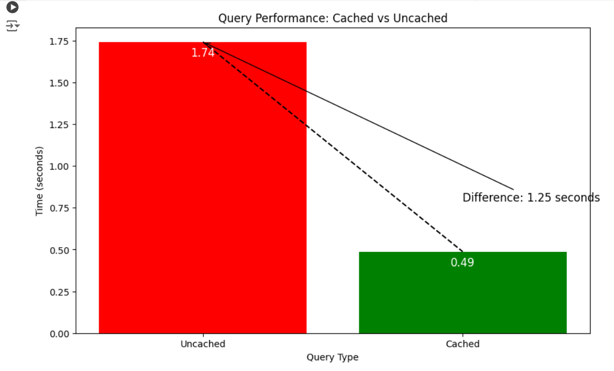

# Home Sales Analysis

This project uses PySpark to analyze home sales data. The analysis includes calculating average home prices based on various criteria.

## Overview

This project leverages PySpark to perform an in-depth analysis of home sales data. The analysis includes calculating key metrics such as average home prices based on different criteria. By utilizing SparkSQL, the project demonstrates efficient data processing techniques, including creating temporary views, caching tables, and partitioning data to optimize query performance.

## Overview

This project leverages PySpark to perform an in-depth analysis of home sales data. The analysis includes calculating key metrics such as average home prices based on different criteria. By utilizing SparkSQL, the project demonstrates efficient data processing techniques, including creating temporary views, caching tables, and partitioning data to optimize query performance.

### Key Features

- **Data Loading:** Read home sales data from a CSV file into a Spark DataFrame.
- **Temporary Tables:** Create and manage temporary tables using SparkSQL for efficient querying.
- **SQL Queries:** Execute complex SQL queries to derive insights from the home sales data.
- **Caching:** Implement caching to improve the performance of repeated queries.
- **Partitioning:** Partition data based on specific fields to enhance query efficiency.
- **Performance Comparison:** Compare the runtime of queries using cached, uncached, and partitioned data.

### Analysis Questions

1. **Average Price for Four-Bedroom Houses:** Calculate the average price for four-bedroom houses sold each year.
2. **Average Price by Year Built (3 Beds, 3 Baths):** Determine the average price of homes built each year with three bedrooms and three bathrooms.
3. **Average Price by Year Built (Specific Criteria):** Find the average price of homes built each year with three bedrooms, three bathrooms, two floors, and at least 2,000 square feet.
4. **Average Price by View Rating:** Calculate the average price of homes based on view ratings for homes with an average price of at least $350,000. Measure the runtime of this query and compare it to the cached version.

### Technical Steps

1. **Set Up Spark Environment:** Ensure PySpark is installed and properly set up.
2. **Load Data:** Read the `home_sales_revised.csv` file into a Spark DataFrame.
3. **Create Temporary Views:** Create a temporary table from the DataFrame for SQL querying.
4. **Execute Queries:** Perform SQL queries to answer the analysis questions.
5. **Caching:** Cache the temporary table and verify the caching status.
6. **Partitioning:** Partition the data by the `date_built` field and save it in Parquet format.
7. **Performance Comparison:** Compare the runtime of queries using uncached, cached, and partitioned data.
8. **Uncache Table:** Uncache the table and verify the uncaching status.


### How to Run

Follow these steps to run the analysis:

- Clone the repository to your local machine:

   ```
   [git clone https://github.com/NataliiaShevchenko620/Home_Sales.git](https://github.com/NataliiaShevchenko620/Home_Sales.git)

   ```

- Navigate to the Project Directory

- Open and run Jupyter Notebook or use Google Collab



## Analisys

The cached query executed in about 0.48 seconds. Uncached query executed in about 1.74 seconds. We can see that the cached query runs almost twice as fast as the previous query without caching. This is a clear example of how storing the table in temporary memory improves the performance of SQL queries.


## Purpose

The primary objective of this project is to utilize PySpark for analyzing a dataset of home sales, demonstrating the power and efficiency of distributed data processing. Through this analysis, the project aims to:

Develop Practical Skills: Enhance proficiency in using PySpark for data analysis and SQL querying.
Optimize Performance: Showcase techniques for optimizing data processing performance, including caching and partitioning.
Extract Insights: Provide meaningful insights into the home sales market by calculating average home prices based on various criteria.
Compare Techniques: Measure and compare the runtime of queries under different conditions (uncached, cached, and partitioned) to understand the benefits of each technique.
This project serves as a hands-on exercise for those looking to deepen their understanding of big data technologies and improve their ability to work with large datasets efficiently.

## Scope

This project focuses on the analysis of home sales data using PySpark and SparkSQL to demonstrate the capabilities and performance of distributed data processing. The scope includes:

1. Data Loading and Preparation:

2. Reading home sales data from a CSV file.

3. Creating temporary views for efficient querying.

4. Data Analysis:

Calculating average home prices based on various criteria (e.g., number of bedrooms, bathrooms, square footage, etc.).
Analyzing average home prices per view rating with conditions on the average price.

5. Performance Optimization:

- Implementing caching to speed up query execution.
- Partitioning data by the date_built field to enhance query efficiency.
- Measuring and comparing query runtimes in different conditions (uncached, cached, and partitioned).

6. Technical Implementation:

- Utilizing PySpark SQL functions for data manipulation and analysis.
- Using Jupyter Notebook for code execution and result visualization.
- Running and timing specific queries to compare performance benefits.

## License

This project is licensed under the MIT License.


